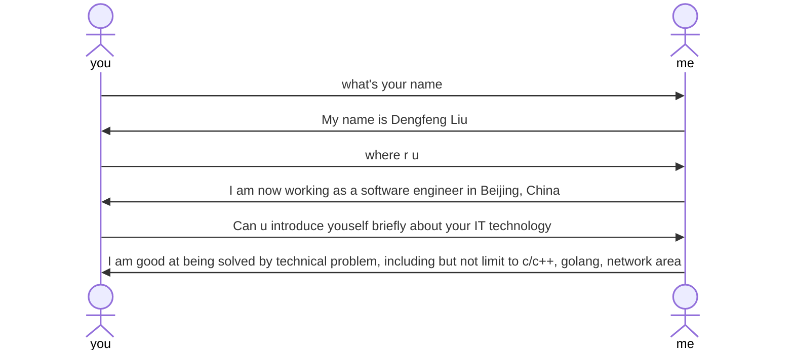

<h1 align="center">👋 𝙷𝚎𝚕𝚕𝚘! 2022</h1>

  
  
  
  

### About me
  

```mermaid
sequenceDiagram
  actor you
  actor me
  
  you ->> me : what's your name
  me ->> you : My name is Dengfeng Liu
  you ->> me : where r u
  me ->> you : I am now working as a software engineer in Beijing, China
  you ->> me : Can u introduce youself briefly about your IT technology
  me ->> you : I am good at being solved by technical problem, including but not limit to c/c++, golang, network area
```

# 

